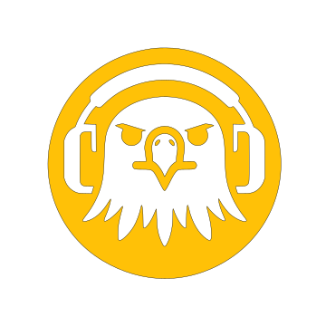

#

The AI-powered sport analysis tool of sports content
[Explore the website >> ](https://tyemalshara.github.io/sportcasterai.de/)
[Report Bug](https://github.com/tyemalshara/sportcasterai.de/issues) · [Request Feature](https://github.com/tyemalshara/sportcasterai.de/issues)

---

#### Table of Contents

- [About the Project](#about-the-project)
  - [Built with](#built-with)  
- [Contact](#contact)
- [Acknowledgments](#acknowledgments)

##### About the Project {#about-the-project}

Landing page for [SportCasterAI](https://tyemalshara.github.io/sportcasterai.de/), the AI-Powered Sport analysis tool of sports content. This product is managed by [Taim](https://github.com/tyemalshara).

[Back to top](#section) 

###### Built With
- 

- 

- 

- 

- 

[Back to top](#section) 

##### Contact {#contact}

- Taim - [@github/tyemalshara](https://github.com/tyemalshara)
- [][discord][discord]: https://discord.gg/s6P4jVMu7f

##### Acknowledgments {#acknowledgments}
